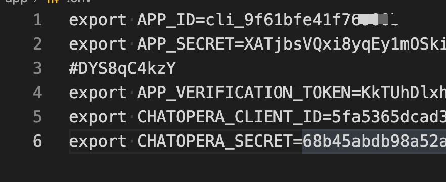

# Chatopera 飞书 Custom App

通过 Feishu 开放平台和 Chatopera 机器人平台上线企业聊天机器人服务。

- Feishu：高效率的协作办公软件
- Chatopera 机器人平台：定制智能对话机器人的开发者平台

## 快速开始

以下【Feishu Bot 应用】是指[飞书开发者平台](https://open.feishu.cn/app)上的 Custom App，并且 Capability 为 【bot】。

<p align="center">
    
</p>

### 创建 Feishu Bot 应用

根据文档创建 Feishu Custom App [https://open.feishu.cn/document/uQjL04CN/ukzM04SOzQjL5MDN](https://open.feishu.cn/document/uQjL04CN/ukzM04SOzQjL5MDN)

在左侧导航栏，进入【Credentials & Basic Info】，得到 `App ID` 和 `App Secret`。

开启 Bot 功能：在 Features 中设置 【Using Bot】为开启状态。

<p align="center">
    
</p>

进入【Event Subscriptions】，获得 `Verification Token`。

<p align="center">
    
</p>

### 创建 Chatopera Bot 应用

登录 Chatopera 云服务 [https://bot.chatopera.com](https://bot.chatopera.com)，创建【机器人】。

<p align="center">
    
</p>

进入机器人设置页面，得到 `Client Id` 和 `Secret`。

<p align="center">
    
</p>

以上提到了两个“Bot 应用”，实际上是一个对话机器人应用的两个部分：**"Feishu Bot 应用" 是渠道，"Chatopera Bot 应用"是自然语言对话管理；前者是“嘴”，后者是“脑”。**

### 编辑描述文件

我们以 Python 语言为例，进入 Python 程序源文件目录[app](./app)。

复制配置文件示例。

```
cd app
cp sample.env .env
vi .env # 使用文本编辑器编辑 .env 文件
```

参数对应列表

| KEY                    | VALUE                | DESCRIPTION                                   |
| ---------------------- | -------------------- | --------------------------------------------- |
| APP_ID                 | `App ID`             | Feishu Custom App Credentials & Basic Info 页 |
| APP_SECRET             | `App Secret`         | Feishu Custom App Credentials & Basic Info 页 |
| APP_VERIFICATION_TOKEN | `Verification Token` | Feishu Custom App Event Subscriptions 页      |
| CHATOPERA_CLIENT_ID    | `Client Id`          | Chatopera 聊天机器人设置页                    |
| CHATOPERA_SECRET       | `Secret`             | Chatopera 聊天机器人设置页                    |

<p align="center">
    
</p>

### 安装依赖

- 前提条件 Python3, pip

安装 Python 依赖

```bash
cd app
pip install -r requirements.txt
```

### 启动服务

```bash
cd app
./serve.sh
```

服务默认使用 8000 端口，可以在 `.env` 中增加环境变量 `PORT=YOUR_PORT` 自定义。

配置 HTTPs 服务，接入飞书要求使用 https server URL，测试目的建议使用 `ngrok`

```bash
ngrok http 8000
```

<p align="center">
    
</p>

如上，得到 https URL 地址：`https://xxx.ngrok.io`。

[ngrok](https://dashboard.ngrok.com/) 下载和注册：https://dashboard.ngrok.com/。

### 配置 Feishu Custom App 消息事件订阅

再次进入 Feishu Custom App Event Subscriptions 页面，编辑 `Request URL` 的值。

将刚刚获得的 https URL 地址填写上，保存。

### 发布上线机器人

1）设置权限
进入飞书 Custom App 管理控制台，打开【Permissions】页面，发布新版本，并且选择权限如下。

<p align="center">
    
</p>

2）发布到企业内部使用

进入飞书 Custom App 管理控制台，打开【Version Management & Release】页面。

<p align="center">
    
</p>

创建新版本，并提交，此时因为企业内部审核，会自动通过。

在飞书客户端，Workspace 中搜索并激活机器人，进入对话界面。

<p align="center">
    
</p>

### 开发

1）修改程序，增加功能

建议安装 Node.js 和 npm，然后可使用下面脚本自动重启。

```
cd app
# liveload script, auto restart app when modifications happens
./dev.sh
```

每次重启后，可能会延迟 20s 生效，因为每次重启会和 Feishu 中间重新做安全校验。

2）增加对话能力

接下来，根据文档定制您的 BOT 对话能力，管理对话，是 Chatopera 机器人平台最核心的功能：

- [Chatopera 机器人平台文档中心](https://docs.chatopera.com/index.html)
- [示例程序](https://github.com/chatopera/chatbot-samples)
- [视频教程](https://ke.qq.com/course/2994143)
- [Deep Dive](https://ke.qq.com/course/2994143?taid=10884018361708511&tuin=6780672d)
- [Python SDK Docs](https://github.com/chatopera/chatopera-py-sdk/)
- [Chatopera 机器人平台系统集成文档](https://docs.chatopera.com/products/chatbot-platform/integration/index.html)

## References

[Create a custom app on Feish](https://open.feishu.cn/document/uQjL04CN/ukzM04SOzQjL5MDN)

[Develop a bot app on Feishu](https://open.feishu.cn/document/uQjL04CN/uYTMuYTMuYTM)

[Chatopera 云服务入门](https://docs.chatopera.com/products/chatbot-platform/index.html)

[Chatopera 云服务 Deep Dive](https://www.bilibili.com/video/BV1tz4y1S78k)

[聊天机器人对话模板：招聘机器人、天气查询、活动通知、寒暄等](https://github.com/chatopera/chatbot-samples)

## 开源许可协议

Copyright 2021 <a href="https://www.chatopera.com/" target="_blank">北京华夏春松科技有限公司</a>

[Apache License Version 2.0](./LICENSE)

[![chatoper banner][co-banner-image]][co-url]

[co-banner-image]: https://static-public.chatopera.com/assets/images/42383104-da925942-8168-11e8-8195-868d5fcec170.png
[co-url]: https://www.chatopera.com
