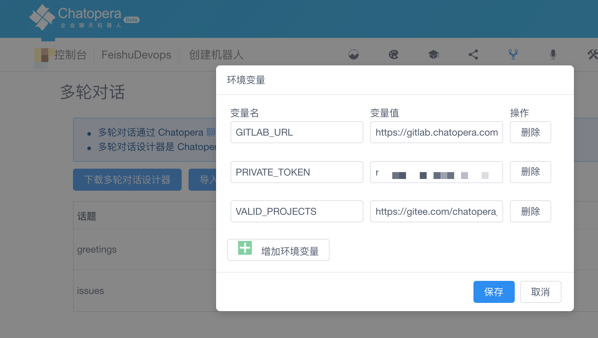

# BOT

低代码或无代码方式开发 BOT 对话！

机器人对话管理 with [Chatopera 机器人平台](https://bot.chatopera.com/)，创建机器人并上传多轮对话 [releases/FeishuDevops.zh_CN.1.0.0.c66](./releases/FeishuDevops.zh_CN.1.0.0.c66)。

## 设置环境变量

<p align="center">
    
</p>

### GITLAB_URL

GitLab 服务地址，比如 https://gitlab.chatopera.com

支持版本：GitLab Community Edition 9.4.1 or Higher

### PRIVATE_TOKEN

在 GitLab Profile Setting 页面，创建 Personal Access Token.
机器人将具备该 Token 的权限操作或查询 GitLab 项目。

### VALID_PROJECTS

JSON 文件的 URL，示例：

https://gitee.com/chatopera_admin/metadata/raw/master/gitlab_projects.json

```
{
    "cskefu": "cskefu/cskefu.io",
    "chatopera": "chatopera/chatopera.bot"
}
```

## 进阶阅读

- [Chatopera 机器人平台文档中心](https://docs.chatopera.com/index.html)
- [示例程序](https://github.com/chatopera/chatbot-samples)
- [视频教程](https://ke.qq.com/course/2994143)
- [Deep Dive](https://ke.qq.com/course/2994143?taid=10884018361708511&tuin=6780672d)
- [Python SDK Docs](https://github.com/chatopera/chatopera-py-sdk/)
- [Chatopera 机器人平台系统集成文档](https://docs.chatopera.com/products/chatbot-platform/integration/index.html)
